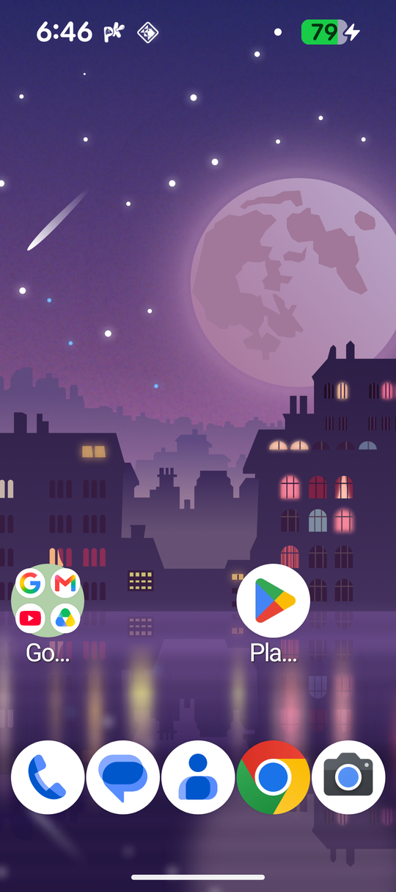

<p align="center">
  
</p>

<h1 align="center">Open Launcher</h1>

<p align="center">
  只做三件事的 Android 桌面啟動器：桌面、應用程式抽屜、Google 新聞頁。
</p>

<p align="center">
  <a href="https://github.com/wustar576/open-launcher/actions/workflows/ci.yml"></a>
  
  
</p>

## 為什麼做這個

現成的第三方啟動器功能很多，但多數人每天真正用到的只有三樣：把 App 和小工具擺在桌面上、在抽屜裡找 App、向右滑看新聞。Open Launcher 只保留這三件事，其他一律拿掉：

- **外觀貼近原生**：5×5 格線、系統字型、系統強調色，沒有多餘的裝飾。
- **設定很少**：設定頁只有「主畫面」「應用程式抽屜」「關於」三頁。
- **啟動器本體不連網**：沒有網路權限，沒有遙測、更新檢查或遠端設定。

<p align="center">
  
  &nbsp;&nbsp;
  
</p>

## 功能

### 桌面

背景完全透明，直接顯示桌布。可以擺放應用程式、建立資料夾、加入與縮放小工具。長按空白處只有三個選項：桌布、小工具、主畫面設定。

### 應用程式抽屜

- **自動分類**：A–Z 清單上方會依用途自動產生分類資料夾（通訊、影音娛樂、相片、生產力、工具、生活……）。成員太少的分類不會出現；所有 App 仍然完整列在 A–Z 清單裡，不會被藏起來。
- **搜尋**：只搜尋本機的應用程式與捷徑，支援模糊比對，打錯一兩個字也找得到。搜尋完全在裝置上進行。
- 抽屜裡的「Open Launcher」圖示就是設定頁的捷徑。

### 新聞頁（Open Launcher Feed）

在桌面第一頁向右滑，開啟 Google Discover。

Google app 只允許系統 App 或可偵錯（debuggable）的 App 連接它的新聞頁服務，一般安裝的啟動器連不上。因此這個功能由**另一個獨立的小 APK**（[`feed/`](feed/)）負責轉接：它沒有任何權限、不存任何資料，只做連線轉送；啟動器本體則維持正常的正式版。不裝它，桌面與抽屜照常使用。原理與測試方式見 [`feed/README.md`](feed/README.md)。

## 安裝

> 目前還沒有發佈版本，現階段請先[從原始碼建置](#從原始碼建置)。發佈後的安裝步驟如下：

1. 到 [Releases](https://github.com/wustar576/open-launcher/releases) 下載 `OpenLauncher-*.apk`；需要新聞頁的話再下載 `open-launcher-feed-*.apk`。
2. 安裝後到「設定 → 應用程式 → 預設應用程式 → 主畫面應用程式」選擇 Open Launcher。
3. 之後想換回原本的桌面，可從「主畫面設定 → 變更預設主畫面應用程式」切換。

需求：Android 8.0 以上；新聞頁另外需要已安裝並登入的 Google app。

## 專案狀態

開發中，尚未發佈正式版本。

| 項目 | 狀態 |
|---|---|
| 桌面、小工具、抽屜分類與搜尋 | 已在實機（Pixel 10 / Android 16）驗證 |
| 新聞頁（開發版啟動器） | 已在實機驗證 |
| 新聞頁（正式版啟動器 + 外掛） | 尚未打通，除錯中（紀錄見 [`feed/README.md`](feed/README.md)） |

## 從原始碼建置

需要 Android Studio（使用內建的 JBR）與 Android SDK。

```bash
./gradlew assembleLawnWithQuickstepGithubDebug      # 啟動器
cd feed && ./gradlew assembleDebug                  # 新聞頁外掛（獨立的 Gradle 專案）
```

切換分支或合併之後，請先 `./gradlew clean` 再建置要裝到手機的 APK。正式版簽章、外掛簽章雜湊與 Windows 上的已知問題見 [`docs/BUILDING.md`](docs/BUILDING.md)；產品規格見 [`docs/specs/open-launcher-spec.md`](docs/specs/open-launcher-spec.md)。

## 參與

問題與建議請開 [Issue](https://github.com/wustar576/open-launcher/issues)；細節見 [`CONTRIBUTING.md`](CONTRIBUTING.md)。

## 授權與致謝

Open Launcher 以 **GPL-3.0-or-later** 授權發佈（[`COPYING`](COPYING)）。

本專案衍生自 [AOSP Launcher3](https://android.googlesource.com/platform/packages/apps/Launcher3/) 與 [Lawnchair](https://github.com/LawnchairLauncher/lawnchair)（皆為 Apache-2.0，部分檔案為 GPL-3.0-or-later），感謝這兩個專案的貢獻者。原始著作權聲明與修改範圍見 [`LICENSE.txt`](LICENSE.txt) 與 [`NOTICE`](NOTICE)。

Open Launcher 是獨立專案，與 Lawnchair 團隊及 Google 無關，也未經其背書。
